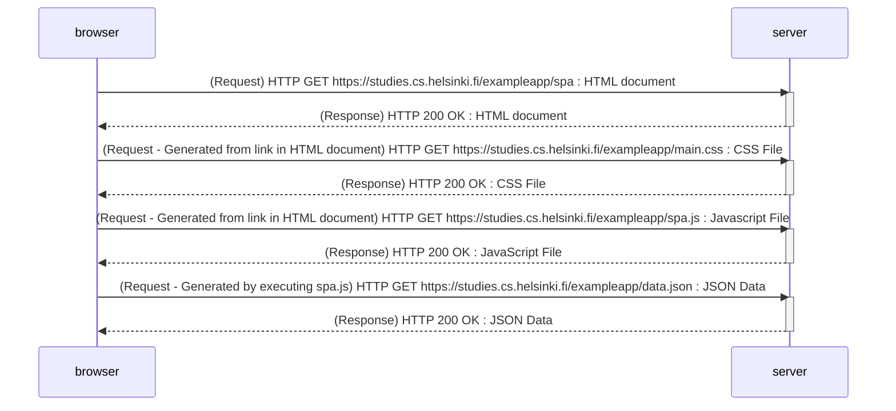

0.5 - SPA loading diagram:

```mermaid
sequenceDiagram
    participant browser
    participant server

    browser->>server: (Request) HTTP GET https://studies.cs.helsinki.fi/exampleapp/spa : HTML document
    activate server
    server-->>browser: (Response) HTTP 200 OK : HTML document
    deactivate server

    browser->>server: (Request - Generated from link in HTML document) HTTP GET https://studies.cs.helsinki.fi/exampleapp/main.css : CSS File
    activate server
    server-->>browser: (Response) HTTP 200 OK : CSS File
    deactivate server

    browser->>server: (Request - Generated from link in HTML document) HTTP GET https://studies.cs.helsinki.fi/exampleapp/spa.js : Javascript File
    activate server
    server-->>browser: (Response) HTTP 200 OK : JavaScript File
    deactivate server

    browser->>server: (Request - Generated by executing spa.js) HTTP GET https://studies.cs.helsinki.fi/exampleapp/data.json : JSON Data
    activate server
    server-->>browser: (Response) HTTP 200 OK : JSON Data
    deactivate server
```
